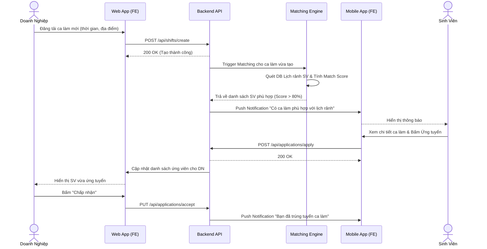
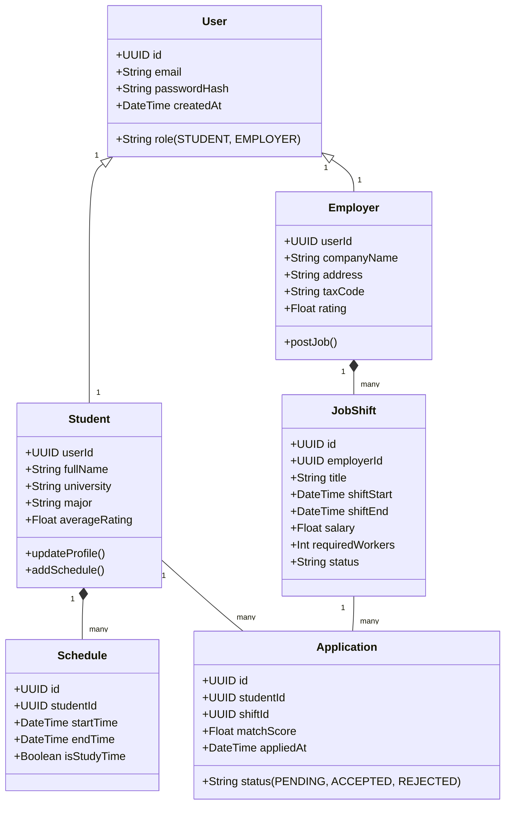
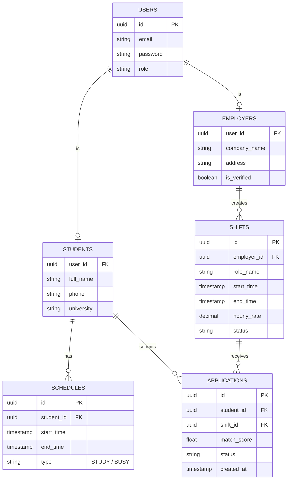

# TÀI LIỆU PHÂN TÍCH VÀ THIẾT KẾ PHẦN MỀM - EDUSHIFT

## 1. TỔNG QUAN DỰ ÁN
**EduShift** là nền tảng kết nối việc làm part-time dành riêng cho sinh viên. Hệ thống tự động phân tích thời khóa biểu (lịch học) và thời gian rảnh của sinh viên để đối chiếu với các ca làm việc từ doanh nghiệp, từ đó đưa ra gợi ý công việc phù hợp nhất (Match Score) nhằm đảm bảo tiêu chí: **Đúng người - Đúng ca - Không trùng lịch học**.

## 2. YÊU CẦU HỆ THỐNG
### 2.1. Yêu cầu chức năng (Functional Requirements)
**Dành cho Sinh viên (Mobile App):**
- Đăng ký/Đăng nhập và quản lý hồ sơ cá nhân.
- Nhập/Đồng bộ lịch học (từ file hoặc thủ công) và thiết lập thời gian rảnh.
- Xem danh sách công việc/ca làm được hệ thống đề xuất (dựa trên thuật toán Matching).
- Ứng tuyển vào ca làm việc và nhận thông báo kết quả.
- Theo dõi lịch làm việc sắp tới, check-in/check-out.
- Đánh giá (Review) doanh nghiệp sau khi hoàn thành ca làm.

**Dành cho Doanh nghiệp (Web App):**
- Đăng ký/Đăng nhập và xác thực thông tin doanh nghiệp.
- Đăng tuyển dụng và tạo các ca làm việc (Shift) cụ thể theo khung giờ.
- Xem danh sách sinh viên được hệ thống tự động đề xuất phù hợp với ca làm.
- Xem hồ sơ (ẩn chi tiết lịch học cá nhân, chỉ hiện độ phù hợp), duyệt ứng viên.
- Quản lý trạng thái ca làm, chấm công cơ bản.
- Đánh giá sinh viên.

**Hệ thống (Core Backend):**
- Thuật toán **Match Score**: Tính toán điểm phù hợp dựa trên (1) Lịch rảnh, (2) Khoảng cách địa lý, (3) Kỹ năng/Đánh giá.
- Hệ thống thông báo (Notification) Real-time.
- Cảnh báo xung đột lịch.

### 2.2. Yêu cầu phi chức năng (Non-functional Requirements)
- **Hiệu năng:** Hệ thống phải phản hồi tính toán Matching dưới 2 giây. Chịu tải được 1000 users truy cập đồng thời.
- **Bảo mật:** Không hiển thị toàn bộ thời khóa biểu cá nhân của sinh viên cho doanh nghiệp (Chỉ trả về trạng thái Khớp/Không khớp). Mã hóa mật khẩu.
- **Khả năng mở rộng:** Kiến trúc Microservices hoặc Modular Monolith, cho phép mở rộng khi tăng số lượng trường đại học và doanh nghiệp.
- **Trải nghiệm người dùng (UX):** Mobile-first cho sinh viên. Thao tác trên Web doanh nghiệp không quá 3 bước để đăng việc.

---

## 3. SƠ ĐỒ TUẦN TỰ (SEQUENCE DIAGRAM)
*Quy trình: Doanh nghiệp đăng ca làm -> Hệ thống Matching -> Sinh viên ứng tuyển*

---

## 4. SƠ ĐỒ LỚP (CLASS DIAGRAM)
*Cấu trúc các thực thể chính trong hệ thống*

---

## 5. THIẾT KẾ CƠ SỞ DỮ LIỆU (ERD)
*Mô hình quan hệ thực thể cốt lõi*

